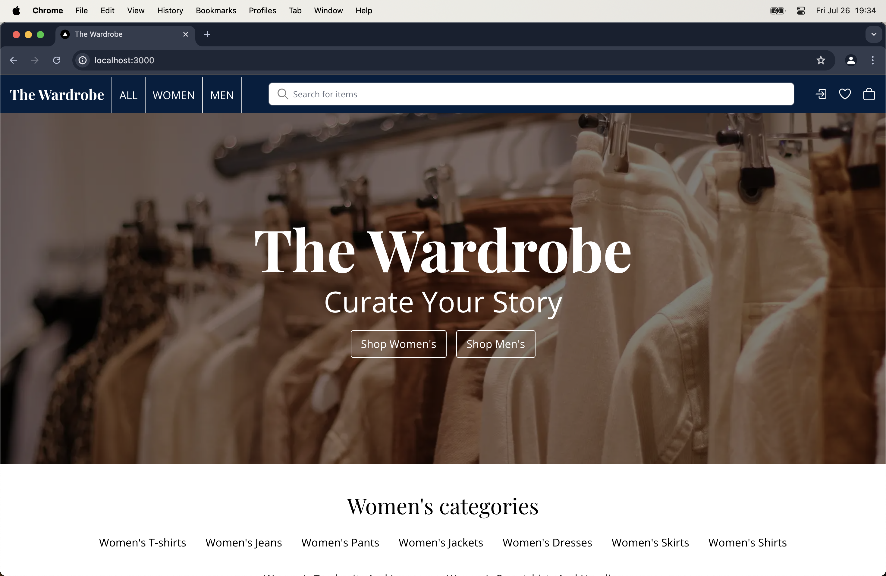
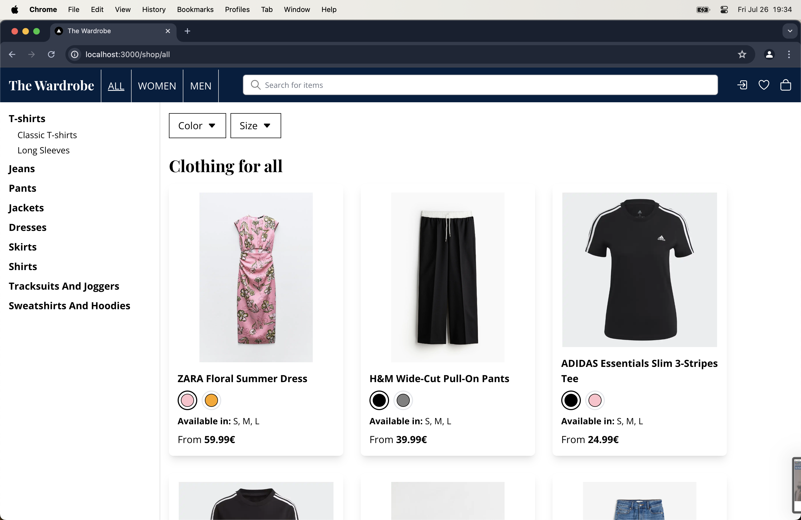
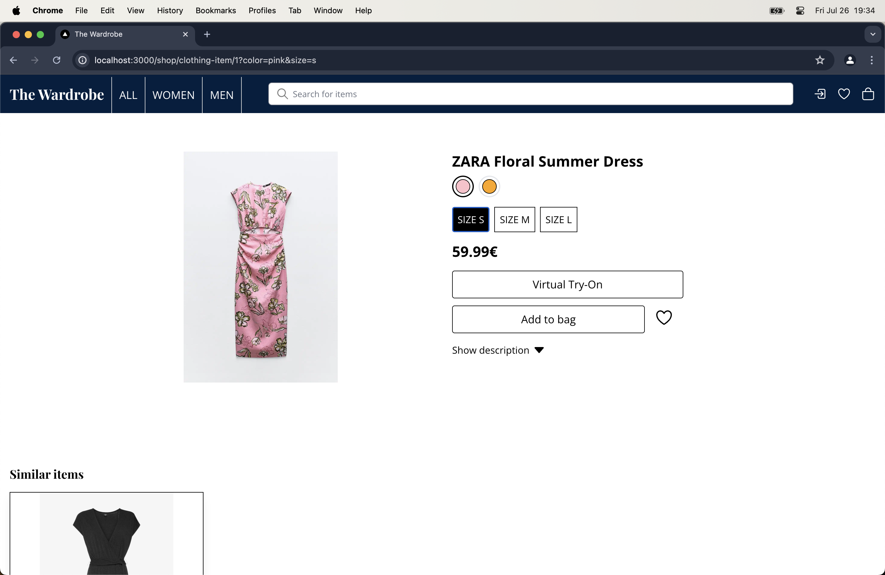
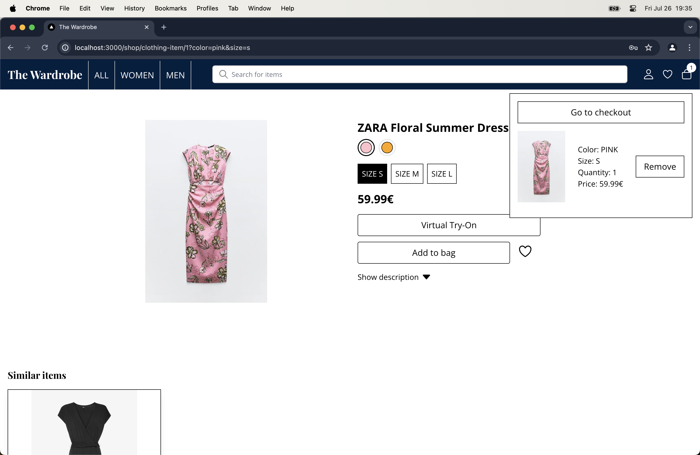

# The Wardrobe

The Wardrobe is an online clothing shop with various options for both men and women. For each clothing
item we are able to select color (if there are more then one) and size. All items are stored in the database
where we also keep track of thier quantitiy. Searching for clothing was never easier because of the search
feature along with categorized and subcategorized sectinos for women, men and all together. User can add
clothing to the bag as well as wishlist. For item to be added in wishlist as well as purchasing the item,
user needs to be authenticated. Stripe is being used for payment, making secure payments easier. Payment
history is shown in the profile page. Lastly virtual try-on feature is being used so that anyone can see
how they will look before buying the clothing item.

## Table of Contents

1. [Installation](#installation)
2. [Gettng Started](#getting-started)
3. [Testing](#testing)
4. [Screenshots](#screenshots)
5. [Disclaimer](#disclaimer)

## Installation

For this project [Node.js](https://nodejs.org/) and npm are required. You can also use alternative package manager.

After cloning the repository run `npm i` to install all the dependencies. You will maybe need to run `npx prisma generate` to generate Prisma types.

## Getting Started

Follow these steps to set up and run the project locally:

1. **Create PostgreSQL Database:**

   - Create local PostgreSQL database and add its URL to the `.env` file:

     ```env
     DATABASE_URL=<your_database_url>
     ```

- To run migrations and seed the database `npx prisma migrate dev`
- To seed the database use command `npx prisma db seed`
- To generate Prisma types `npx prisma generate`

2. **Configure Authentication:**

- For the `Auth.js` authentication to work, you need to add a secret key:

  ```env
  AUTH_SECRET=<your_secret_key>
  ```

  You can see more about Auth.js installation [here](https://authjs.dev/getting-started/installation).

- To enable Google authentication, go to the Google API Console and obtain credentials:
  ```env
  AUTH_GOOGLE_ID=<your_google_id>
  AUTH_GOOGLE_SECRET=<your_google_secret>
  ```
- Check the [Google API docs](https://developers.google.com/identity/protocols/oauth2) for more information.

3. **Set Up Stripe Payments:**

- Go to the Stripe developer dashboard and generate the necessary keys:
  ```env
  STRIPE_TEST_SECRET_KEY=<your_stripe_test_secret_key>
  NEXT_PUBLIC_TEST_STRIPE_PUBLISHABLE_KEY=<your_stripe_publishable_key>
  ```

4. **Configure Virtual Try-On Feature:**

- For the Virtual Try-On feature, obtain the FAL_KEY:
  ```env
  FAL_KEY=<your_fal_key>
  ```
- Refer to the [FAL API docs](https://fal.ai/models/fal-ai/idm-vton/api) for more details.

You can check an example of the `.env` file in `.env.example`.

After filling in the environment variables, you can use one of the following commands to run the server:

```bash
npm run dev
# or
yarn dev
# or
pnpm dev
# or
bun dev
```

Open [http://localhost:3000](http://localhost:3000) with your browser to see the result.

## Testing

To test the application you need to create local test Postgres database. You can then add database url to the `.env`:

```env
TEST_DATABASE_URL=<your_database_url>
```

After that update `schema.prisma` to use test database.

- For unit test using jest run command: `npm run test`
- For e2e test using playwright run command: `npm run e2e:test`

## Screenshots

|  |  |
| -------------------------------------------- | -------------------------------------------- |
|  |  |

## Disclaimer

This project utilizes images of clothing items sourced from various websites. I do not own the rights to these images, logos, or the names of the items. This project is created purely for educational purposes and not for commercial use. All rights to the images and logos belong to their respective owners.
